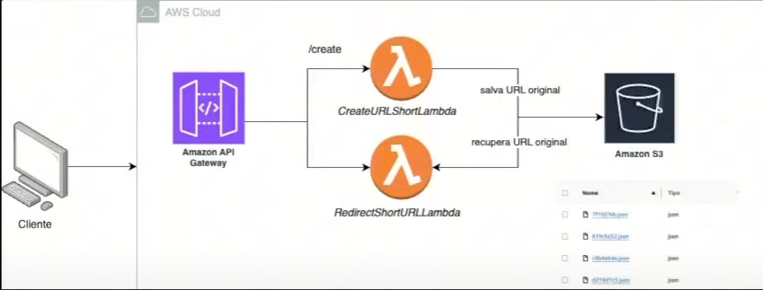

# Serverless URL Shortener

Este repositório contém um sistema de **encurtamento de URLs** utilizando **arquitetura serverless** com **AWS Lambda** e **Amazon S3** como banco de dados. O objetivo principal é criar uma solução escalável e de fácil manutenção, que aproveite as vantagens da computação serverless.

## Estrutura do Repositório

O projeto está organizado em duas funções Lambda separadas, cada uma responsável por um aspecto do sistema de encurtamento de URLs:

1. **CreateUrlLambda**:  
   Função Lambda responsável por criar um novo link encurtado para uma URL fornecida. Ela gera um identificador único (um hash, por exemplo) para a URL e a armazena no **Amazon S3**, juntamente com a URL original. O S3 é utilizado como banco de dados para armazenar os pares de URLs (encurtada e original).

2. **RedirectUrlShortener**:  
   Função Lambda responsável por redirecionar os usuários para a URL original a partir do link encurtado. Ela recebe um link encurtado como entrada e redireciona para a URL original associada. As URLs encurtadas são recuperadas do **Amazon S3**.

### Como o S3 é utilizado como banco de dados?

O **Amazon S3** é utilizado para armazenar os pares de URLs encurtadas e originais. Cada par é armazenado em um objeto no S3, onde o nome do objeto (ou chave) é o identificador único gerado para a URL encurtada. O conteúdo do objeto contém a URL original correspondente.

Isso permite um armazenamento simples e escalável, aproveitando as características do S3, como:

- Escalabilidade automática.
- Flexibilidade de armazenamento.
- Facilidade de integração com outras funções da AWS.

### Como o API Gateway é utilizado?

O **Amazon API Gateway** é utilizado para expor as funções Lambda como endpoints HTTP, permitindo que os usuários interajam com o sistema de encurtamento de URLs de forma simples e eficiente.

- **Para a função `CreateUrlLambda`**: O API Gateway recebe uma requisição HTTP `POST` com a URL original e encaminha a solicitação para a função Lambda, que cria um link encurtado e retorna o identificador único gerado.

- **Para a função `RedirectUrlShortener`**: O API Gateway recebe uma requisição HTTP `GET` com a URL encurtada e encaminha para a função Lambda, que busca a URL original no S3 e realiza o redirecionamento.

O API Gateway é configurado para garantir a comunicação eficiente e segura entre o cliente (usuário) e as funções Lambda, fornecendo recursos como:

- **Gerenciamento de tráfego**: Capacidade de escalar automaticamente conforme a demanda.
- **Segurança**: Configuração de autenticação e controle de acesso via IAM ou outras soluções de segurança.
- **Facilidade de integração**: Permite que a aplicação seja acessada de qualquer cliente HTTP.

## Tecnologias Usadas

- **Java**: 17
- **Maven**: Para gerenciar dependências.
- **AWS Lambda**: Para execução das funções serverless.
- **Amazon S3**: Para armazenamento de URLs encurtadas e originais.
- **API Gateway**: Para gerenciar a exposição das funções Lambda via API HTTP.
- **AWS IAM**: Para gerenciamento de permissões de acesso e segurança.
